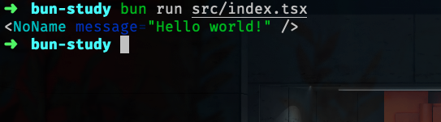
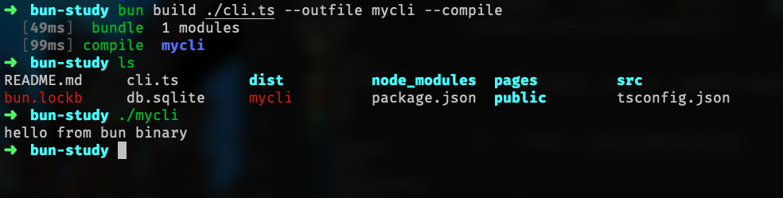
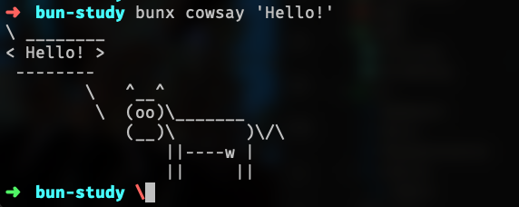
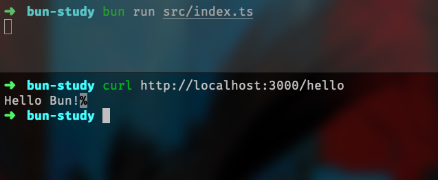
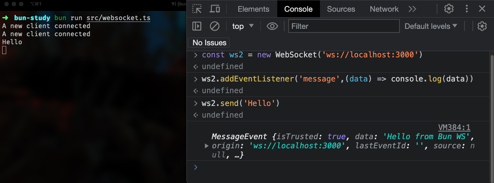
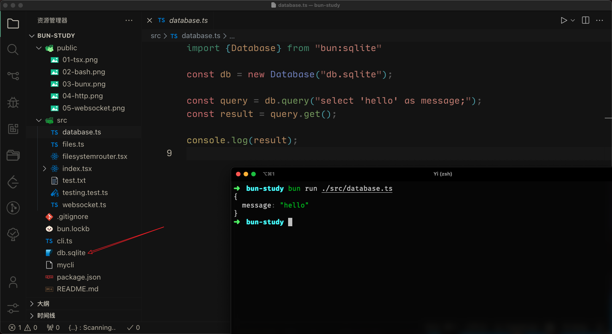
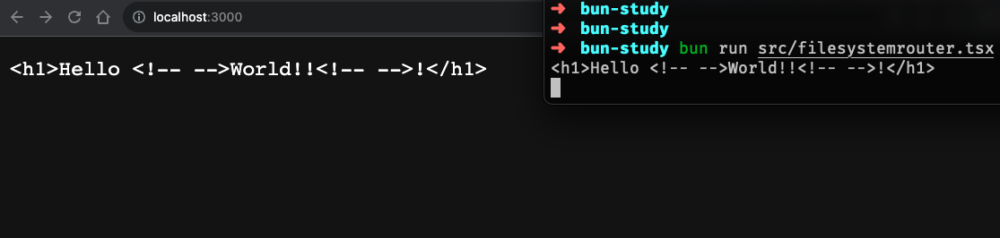
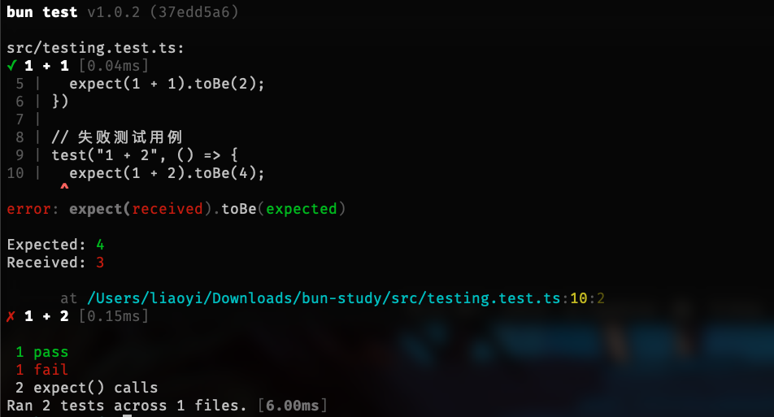

# bun Study 

安装依赖

```bash
bun install
```

运行文件

```bash
bun run src/index.ts
```

### 运行 tsx 

安装依赖

```bash
bun add react react-dom @types/react @types/react-dom
```

添加 `src/index.tsx` 文件

``` tsx
import React from 'react';

function Component(props: {message: string}) {
  return (
    <body>
      <h1 style={{color: 'red'}}>{props.message}</h1>
    </body>
  );
}
console.log(<Component message="Hello world!" />);
```


```bash
bun run src/index.tsx
```





### Bun API 

Bun.build() 用于构建项目

```ts
Bun.build({
  /** 入口文件 */  
  entrypoints: ["./src/index.tsx"],
  /** 输出目录 */
  outdir:"./dist"
})
```

执行 `bun run src/index.ts` 命令，会在 `dist` 目录下生成 `index.js` 文件

查看 `dist/index.js` 文件，发现 `react` 包相关的代码也被打包进去了

```js
// node_modules/react/cjs/react.development.js
// node_modules/react/index.js
// node_modules/react/cjs/react-jsx-dev-runtime.development.js
// node_modules/react/jsx-dev-runtime.js
// src/index.tsx
```

我们可以更改一下配置，让 `react` 包不被打包进去

```ts
Bun.build({
  entrypoints: ["./src/index.tsx"],
  outdir:"./dist",
  /** 设置包作为单独的依赖保留 (不被构建的包) */
  external: ["react", "react-dom"]
})
```

使用bun，你还可以做一些有趣的构建，比如把 `js` 文件构建成可执行的二进制文件

新建一个 `cli.ts` 文件：

```
#!/usr/bin/env bun

console.log("hello from bun binary");
```

执行命令

```
bun build ./cli.ts --outfile mycli --compile
```



### Bunx 

类似与 `npx`  

可以运行下面命令

```shell
bunx cowsay "Hello!"
```




### 创建 HTTP 服务器

``` ts
import { type ServeOptions } from "bun"

Bun.serve({
  fetch(request: Request) {
    if(request.url.indexOf('hello')!= -1){
      return new Response("Hello Bun!")
    }
    throw new Error("bad request");
  },

  error(error) {
    console.log(error)
    return new Response("oops!!")
  }
} as ServeOptions)
```




你甚至可以创建一个 https 服务器


``` ts
import { type ServeOptions } from "bun"

Bun.serve({
  fetch(request: Request) {

    // 判断 request.url  是否存在 'hello'
    if(request.url.indexOf('hello')!= -1){
      return new Response("Hello Bun!")
    }
    throw new Error("bad request");
  },

  error(error) {
    console.log(error)
    return new Response("oops!!")
  },

  // 读取证书文件
  tls: {
    key: Bun.file("./key.pem"),
    cert: Bun.file("./cert.pem")
  }

} as ServeOptions)
```

### 创建 Webscoket 服务

```ts
Bun.serve({
  fetch(req, server) {
    if (server.upgrade(req)) {
      return;
    }
    return new Response("Upgrade failed", { status: 500});
  },
  websocket: {
    open() {
      console.log("A new client connected");
    },
    message(ws, message) {
      console.log(message);
      ws.sendText("Hello from Bun WS");
    }
  }
})
```



### 文件操作

```ts

// 读文件
const file = Bun.file("package.json")
const contents = await file.json()

console.log('package.json\n', contents)

if (contents.scripts) {
  contents.scripts.start = "bun run src/files.ts"
}

// 写文件
Bun.write("package.json", JSON.stringify(contents, null,2))


/**
 *  bun 不推荐使用 fs 模块, __dirname, __filename
 *  如果需要获取文件信息，可以使用 import.meta
*/

// 文件源信息
const { file: theFile, path, dir, main, url } = import.meta

console.log({
  /* 文件名 -> file.ts */
  file: theFile,
  /* 文件路径 -> /Users/xxx/xxx/bun-study/src/files.ts */
  path,
  /* 文件目录 -> /Users/xxx/xxx/bun-study/src */
  dir,
  /* 是否为文件主目录 -> true */
  main,
  /* 文件 url -> file:///Users/xxx/xxx/bun-study/src/files.ts */
  url
})

/* 使用源信息读取文件并写入 */
const txt = `${import.meta.dir}/test.txt`

// open writer
const file2 = Bun.file(txt)
const  writer = file2.writer()

// write some stuff
writer.write("Something \n")

// do some stuff
console.log("Still writing");


// write some more stuff
writer.write("Something else \n")
console.log("Wrote some more stuff");
console.log("Finishing..");

// flush writer
writer.flush();
// close
writer.end();

// 直接写入会覆盖 package.json 文件
// Bun.write(file, "Some content to stdout")

// 执行后，命令行最左侧显示 "Bun ❤️"
Bun.write(Bun.stdout, "Bun ❤️")
```


### 链接数据库


```ts
import {Database} from "bun:sqlite"

const db = new Database("db.sqlite");

const query = db.query("select 'hello' as message;");
const result = query.get();

console.log(result);

db.close();
```




### 文件系统路由

新建 `src/filesystemrouter.ts` 文件

```ts
import {renderToString} from "react-dom/server";

const router = new Bun.FileSystemRouter({
  // 设置路由风格, 默认为 nextjs (目前唯一支持的风格)
  style: "nextjs",
  // 设置页面目录, 默认为 "./pages"
  dir: "./pages"
})

// 匹配路由,设置为根目录
const theMatch = router.match("/");

if (!theMatch) throw new Error("no match");

const App = (await import(theMatch.filePath)).default

console.log(renderToString(<App message="World!!" />))


Bun.serve({
  fetch(req) {
    const match = router.match(req)
    if (match) {
      return new Response(renderToString(<App message="World!!" />))
    }
    return new Response("Not found", {status: 404})
  }
})
```



### 测试

```ts
import { expect, test } from "bun:test"

// 成功测试用例
test("1 + 1", () => {
  expect(1 + 1).toBe(2);
})

// 失败测试用例
test("1 + 2", () => {
  expect(1 + 2).toBe(4);
})

```

